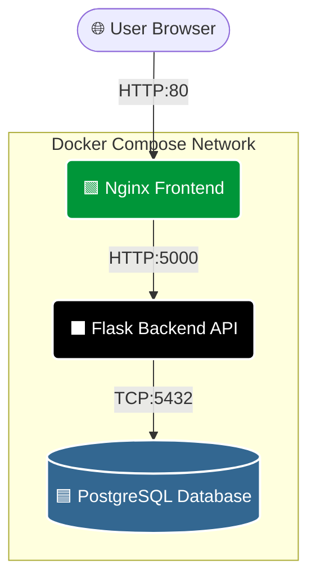

# Phase 1: Application & Containerization Basics

Welcome to **Phase 1** of the DevOps Masterclass! 

In this phase, you will learn the core architecture of the application you are about to deploy, monitor, and scale. Before you can automate infrastructure or orchestrate containers in Kubernetes, you must understand how the raw application works locally.

## The 3-Tier Architecture

This directory contains the source code for the MoreCraze E-Commerce application. It follows a standard 3-tier architecture:



- **`frontend/`**: An Nginx web server serving static HTML/JS.
- **`backend/`**: A Python Flask API connecting to a PostgreSQL database.

## How to Complete This Phase

Your goal is to run this application locally using Docker Compose to see how the containers communicate with each other over a local Docker network.

1. **Go to the root directory** of the repository.
2. **Start the application** using Docker Compose:
   ```bash
   docker compose up -d
   ```
3. **Verify it is running:**
   ```bash
   docker ps
   curl http://localhost/health
   ```
   You should see a `healthy` JSON response from the API.

## Next Steps

Once you understand how `docker-compose.yml` links the Nginx container to the Flask container and the Postgres database, you are ready to move on to monitoring.

**Proceed to 👉 [`2-labs/`](../2-labs/README.md)**
