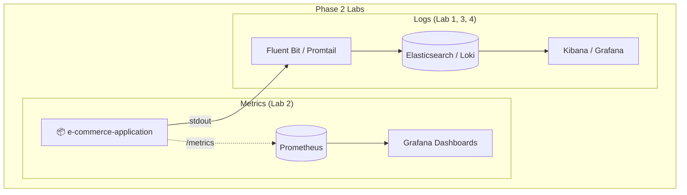

# Phase 2: Observability Fundamentals

Welcome to **Phase 2** of the DevOps Masterclass!

In Phase 1, you learned how the application runs. But what happens when it breaks? How do you see the logs? How do you monitor CPU usage? That's where Observability comes in.

This folder is designed specifically for **[iximiuz Labs](https://labs.iximiuz.com/)**, giving you a safe sandbox to learn these tools without breaking your local machine.

## The Observability Landscape



## How to Complete This Phase

This phase is broken down into 4 sub-modules. You must complete them in order:

1. **`1-elk-docker/`**: Learn how Fluent Bit collects raw logs and sends them to Elasticsearch.
2. **`2-prom-grafana-docker/`**: Learn how Prometheus scrapes metrics from your Flask app.
3. **`3-plg-k8s/`**: Move to Kubernetes and learn the Promtail/Loki stack.
4. **`4-efk-k8s/`**: Graduate to the enterprise standard: Elasticsearch, Fluent Bit, and Kibana on Kubernetes.

### The Master Script
To easily spin up any of these environments, go to the root of the repository and run:
```bash
./scripts/setup/learning-lab.sh
```

## Next Steps

Once you understand how log aggregation and metrics scraping work natively, it's time to learn how to properly orchestrate the application itself in Kubernetes.

**Proceed to 👉 [`3-kubernetes/`](../3-kubernetes/README.md)**
