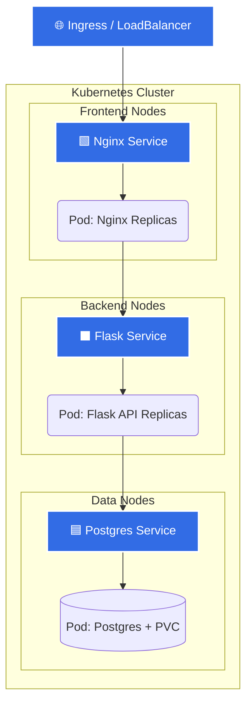

# Phase 3: Kubernetes Fundamentals

Welcome to **Phase 3** of the DevOps Masterclass!

You know how the app works, and you know how to monitor it. Now, it's time to scale it. Docker Compose is great for local development, but enterprise applications run on Kubernetes.

## The Kubernetes Architecture



## Folder Structure

This directory contains two primary learning paths:

1. **`base/` (The Fundamentals)**
   - Here, you will find pure, raw Kubernetes YAML manifests. 
   - Learn how `Deployments`, `Services`, `ConfigMaps`, and `Secrets` are explicitly defined.

2. **`helm/` (The Enterprise Standard)**
   - Once you understand raw manifests, you will learn **Helm**, the Kubernetes package manager.
   - Look inside to see how we use `values.yaml` to dynamically inject variables into templates, allowing us to easily deploy to different environments (Dev vs. Prod) using a single chart.

## How to Complete This Phase

1. **Deploy using Helm:**
   ```bash
   helm install ecommerce ./3-kubernetes/helm -n prod-ecommerce --create-namespace
   ```
2. **Verify the Deployment:**
   ```bash
   kubectl get all -n prod-ecommerce
   ```
   *Note: If pods fail to start due to missing AWS Secrets, you will solve that in Phase 5.*

## Next Steps

Manually running `helm install` from your laptop isn't how real companies deploy code. You need to automate it.

**Proceed to 👉 [`4-ci-cd/`](../4-ci-cd/README.md)**
