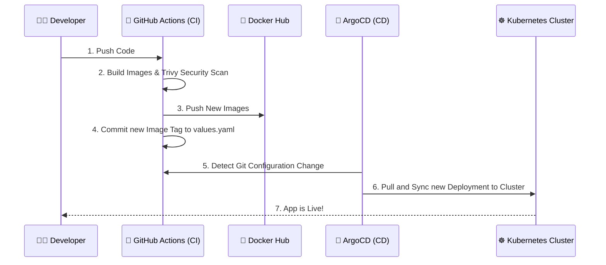

# Phase 4: CI/CD Pipeline Automation (GitOps)

Welcome to **Phase 4** of the DevOps Masterclass!

At this point, you have an application, you know how to monitor it, and you know how to define it in Kubernetes. But how does new code actually get from a developer's laptop into production securely and efficiently?

In the real world, modern cloud-native companies have abandoned heavy, VM-based CI servers (like Jenkins) in favor of **SaaS Continuous Integration** paired with **GitOps Continuous Deployment**.

## The GitOps Pipeline Architecture

## How to Complete This Phase

This phase is broken into two components: Continuous Integration (CI) and Continuous Deployment (CD).

### 1. Continuous Integration (GitHub Actions)
1. **Open `.github/workflows/ci-cd.yml`** at the root of the repository.
2. **Study the Workflow:** Notice how the pipeline is entirely serverless. Upon a push to the `main` branch, GitHub spins up an Ubuntu runner to:
   - Build the Docker images from the `1-apps/` folder.
   - Scan the images using Trivy.
   - Push them to Docker Hub.
   - Automatically modify the image tag inside `3-kubernetes/helm/values.yaml` and commit it back to the repository.

### 2. Continuous Deployment (ArgoCD)
1. Navigate to **[`argocd/`](argocd/README.md)**.
2. Follow the instructions to install ArgoCD into your Kubernetes cluster.
3. Apply the ArgoCD `Application` manifest. From this moment on, ArgoCD will continuously watch your repository and automatically deploy any changes pushed by GitHub Actions.

## Next Steps

You now have a fully automated, GitOps-driven application pipeline. The final piece of the puzzle is provisioning the actual cloud infrastructure to run it all.

**Proceed to 👉 [`5-terraform/`](../5-terraform/README.md)**
