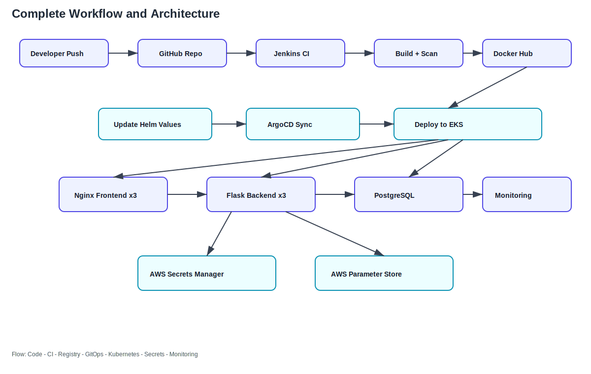
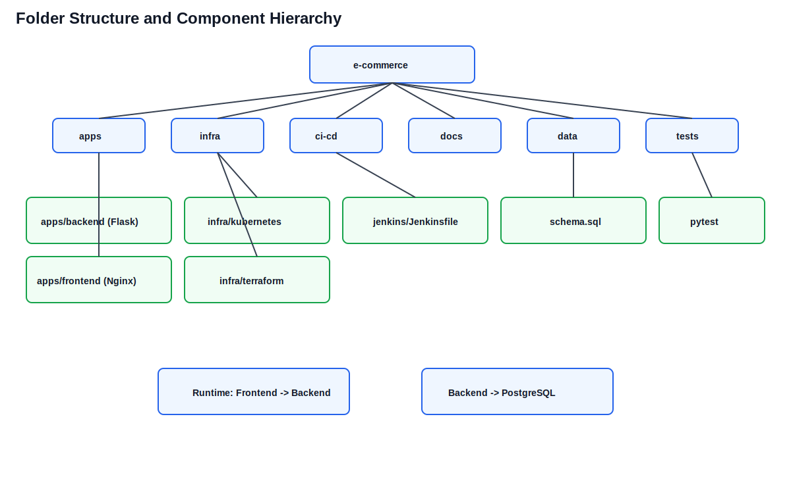
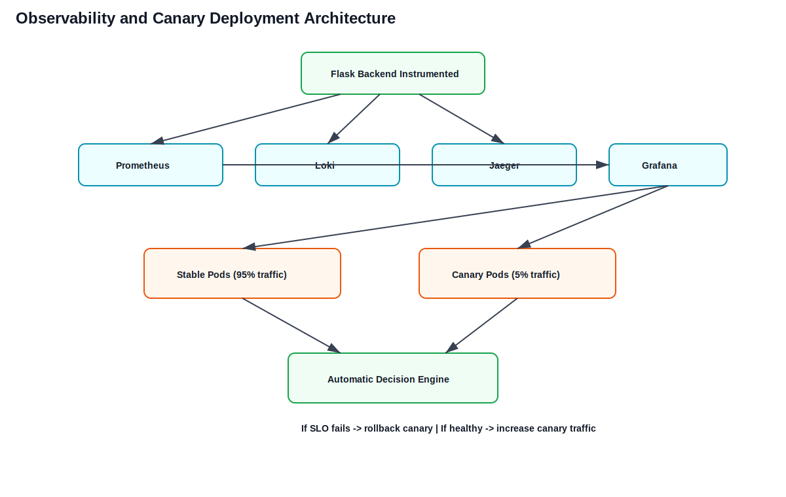
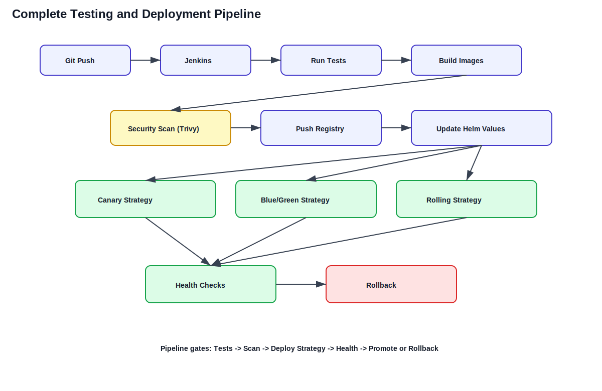
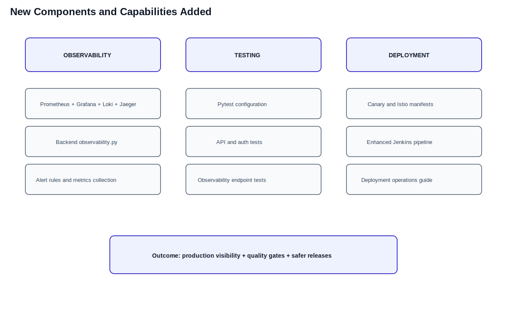

# 🚀 MoreCraze E-Commerce Application on AWS EKS

> **Production-Ready Infrastructure as Code | AWS RDS & EKS Deployment | Enterprise-Level Architecture**

<!-- Badges -->
<div align="center">


</div>

---

## 📋 Table of Contents

1. [Quick Start](#quick-start)
2. [Helm Deployment (Recommended)](#helm-deployment-recommended)
3. [Architecture Diagrams (SVG)](#architecture-diagrams-svg)
4. [Architecture Overview](#architecture-overview)
5. [Prerequisites](#prerequisites)
6. [Project Structure](#project-structure)
7. [Terraform - Secrets & Parameters](#terraform---secrets--parameters)
8. [External Secrets Integration](#external-secrets-integration)
9. [IRSA Setup](#irsa-setup)
10. [Deployment Methods](#deployment-methods)
11. [Troubleshooting](#troubleshooting)
12. [AWS CLI Commands Reference](#aws-cli-commands-reference)
13. [Cleanup & Destruction](#cleanup--destruction)

---

## Architecture Diagrams (SVG)

These diagrams are stored as SVG files for long-term reuse and easy updates.

### 1) Complete Workflow and Architecture



### 2) Folder Structure and Component Hierarchy



### 3) Observability and Canary Deployment Architecture



### 4) Complete Testing and Deployment Pipeline



### 5) New Components and Capabilities Added



---

## Quick Start

### 3-Minute Helm Deployment

```powershell
# 1. Deploy Terraform secrets (AWS credentials & parameters)
cd infra/terraform
terraform init
terraform apply

# 2. Deploy entire application using Helm
cd ../..
helm install ecommerce ./infra/kubernetes/helm -n prod-ecommerce --create-namespace

# 3. Verify deployment
kubectl get all -n prod-ecommerce
kubectl get externalsecrets -n prod-ecommerce -o wide
```

**Expected Result:** All pods running, External Secrets syncing, app accessible

### Destroy When Done

```powershell
# Helm uninstall
helm uninstall ecommerce -n prod-ecommerce

# Terraform destroy
cd terraform
terraform destroy
```

---

## Helm Deployment (Recommended)

### Why Helm?

- **Package Management**: All K8s resources in one chart
- **Version Control**: Easy to version and rollback
- **Templating**: Dynamic values for different environments
- **GitOps Ready**: ArgoCD can read and deploy Helm charts
- **Easy Updates**: Single command to update all components

### Setup

```powershell
# Install Helm (if not already installed)
# Windows: choco install kubernetes-helm
# Linux/Mac: brew install helm

# Verify
helm version
```

### Deploy with Helm

```powershell
# Add repository or use local chart
cd c:\Users\don81\OneDrive\Desktop\demo

# Dry-run to preview
helm install ecommerce ./infra/kubernetes/helm -n prod-ecommerce --create-namespace --dry-run

# Install
helm install ecommerce ./infra/kubernetes/helm -n prod-ecommerce --create-namespace

# Verify
helm list -n prod-ecommerce
helm status ecommerce -n prod-ecommerce
```

### Update Configuration

```powershell
# Edit values
notepad infra/kubernetes/helm/values.yaml

# Upgrade
helm upgrade ecommerce ./infra/kubernetes/helm -n prod-ecommerce

# Rollback if needed
helm rollback ecommerce 1 -n prod-ecommerce
```

### Helm Values Override

```powershell
# Override specific values on command line
helm install ecommerce ./infra/kubernetes/helm -n prod-ecommerce \
  --set application.flask.replicas=5 \
  --set application.nginx.replicas=3 \
  --set database.storage=50Gi

# Or use custom values file
helm install ecommerce ./infra/kubernetes/helm -n prod-ecommerce \
  -f custom-values.yaml
```

### View Helm Chart Content

```powershell
# Template rendering (see what will be deployed)
helm template ecommerce ./infra/kubernetes/helm -n prod-ecommerce

# Get values
helm get values ecommerce -n prod-ecommerce

# Get manifest after deployment
helm get manifest ecommerce -n prod-ecommerce
```

### Uninstall

```powershell
# Uninstall (keeps PVCs)
helm uninstall ecommerce -n prod-ecommerce

# Delete namespace
kubectl delete namespace prod-ecommerce
```

---

## Quick Start (Legacy - kubectl apply)

---

## Architecture Overview

```
┌─────────────────────────────────────────────────────────┐
│                    AWS Account (593067253640)           │
│  ┌──────────────────────────────────────────────────┐   │
│  │  AWS Secrets Manager (3 secrets)                │   │
│  │  ├─ ecommerce/database-url (Auto-generated)     │   │
│  │  ├─ ecommerce/secret-key                        │   │
│  │  └─ ecommerce/docker-config                     │   │
│  └────────────────────┬─────────────────────────────┘   │
│  ┌────────────────────v─────────────────────────────┐   │
│  │  Parameter Store (3 parameters)                 │   │
│  │  ├─ /ecommerce/flask-env                        │   │
│  │  ├─ /ecommerce/debug                            │   │
│  │  └─ /ecommerce/log-level                        │   │
│  └────────────────────┬─────────────────────────────┘   │
│  ┌────────────────────v─────────────────────────────┐   │
│  │  Amazon RDS (PostgreSQL 15)                     │   │
│  │  └─ db.t3.micro (ecommerce_db)                  │   │
│  └────────────────────┬─────────────────────────────┘   │
│  ┌────────────────────v─────────────────────────────┐   │
│  │  IAM Role (ecommerce-external-secrets-role)     │   │
│  │  └─ Trust: OIDC Provider                        │   │
│  └────────────────────┬─────────────────────────────┘   │
└─────────────────────────────────────────────────────────┘
                       │
              ┌────────v────────┐
              │  EKS Cluster    │
              │  (eu-north-1)   │
              └────────┬────────┘
        ┌─────────────v──────────────┐
        │ External Secrets Operator  │
        │ └─ SecretStore (AWS)       │
        └─────────────┬──────────────┘
                      │
        ┌─────────────v──────────────┐
        │ Kubernetes Secrets         │
        │ ├─ ecommerce-secrets       │
        │ └─ ecommerce-params        │
        └─────────────┬──────────────┘
                      │
        ┌─────────────v──────────────┐
        │ Application Pods           │
        │ ├─ Flask API (3x)          │
        │ ├─ Nginx Frontend (3x)     │
        │ └─ DB Init Job (Hook)      │
        └────────────────────────────┘
```

---

## Prerequisites

### Required Tools
- ✓ AWS CLI (configured with credentials): `aws sts get-caller-identity`
- ✓ Terraform (v1.0+): `terraform version`
- ✓ kubectl (configured for EKS): `kubectl cluster-info`
- ✓ EKS Cluster already created
- ✓ External Secrets Operator installed

### AWS Account Details
- **Account ID:** 593067253640
- **Region:** eu-north-1
- **OIDC ID:** D9F3585A3CEB7F58435405A9E7833268

---

## Project Structure

```
e-commerce/
├── apps/                               # Application source code
│   ├── backend/                         # Flask backend API
│   │   ├── app.py
│   │   ├── requirements.txt
│   │   └── Dockerfile
│   └── frontend/                        # Nginx frontend
│       ├── index.html
│       ├── nginx.conf
│       ├── /static
│       ├── /images
│       └── Dockerfile
│
├── infra/                              # Infrastructure as Code
│   ├── kubernetes/
│   │   ├── helm/                        # ⭐ PRIMARY - Helm Chart (use this!)
│   │   │   ├── Chart.yaml
│   │   │   ├── README.md
│   │   │   ├── values.yaml
│   │   │   ├── values-dev.yaml
│   │   │   ├── values-prod.yaml
│   │   │   └── templates/
│   │   └── base/                        # 📚 REFERENCE - K8s learning manifests
│   │       ├── 01-namespace.yaml
│   │       ├── 02-configmaps.yaml
│   │       └── kustomization.yaml
│   └── terraform/                       # 🏗️ AWS Infrastructure as Code
│       ├── provider.tf
│       ├── variables.tf
│       ├── secrets.tf
│       ├── parameters.tf
│       └── outputs.tf
│
├── ci-cd/                              # CI/CD Pipeline
│   └── jenkins/
│       ├── Jenkinsfile
│       └── docker-compose.yml
│
├── scripts/                            # Automation scripts
│
├── docs/                               # Documentation
│
├── data/                               # Database schema
│   └── schema.sql
│
├── tests/                              # Test suites
│
└── README.md                           # This file
```

**Legend:**
- ⭐ **infra/kubernetes/helm/** - Use for deployment (Kubernetes package management)
- 📚 **infra/kubernetes/base/** - Reference learning (individual K8s manifests)
- 🏗️ **infra/terraform/** - AWS infrastructure (secrets & parameters)

---

## Quick Start (Legacy - kubectl apply)

Use **Helm instead** (see section above), but if you prefer manual kubectl:

```powershell
# Deploy all K8s resources from manifests
kubectl apply -k k8s/

# Verify
kubectl get all -n prod-ecommerce
```

---

## Project Structure

---

## Terraform - Secrets & Parameters

### Overview

Terraform manages all AWS secrets and parameters in **Infrastructure as Code**.

**Resources Created:**
- 3 Secrets Manager secrets (database-url, secret-key, docker-config)
- 3 Parameter Store parameters (flask-env, debug, log-level)
- IAM policy for External Secrets access
- Secret access policy

### Setup

#### 1. Initialize

```powershell
cd terraform
terraform init
```

#### 2. Configure Variables

```powershell
# Copy example
Copy-Item terraform.tfvars.example terraform.tfvars

# Edit with your values
notepad terraform.tfvars
```

**Required values:**
```hcl
secret_key = "your-production-secret-key-here"
docker_config = '{"auths":{"docker.io":{"username":"privatergistry","password":"YOUR_PASSWORD"}}}'
flask_env = "production"
debug_mode = "false"
log_level = "INFO"
```
*(Note: `database_url` is automatically generated by Terraform upon creating the RDS instance and placed directly into Secrets Manager.)*

#### 3. Plan & Apply

```powershell
# Review changes
terraform plan

# Apply
terraform apply

# View outputs
terraform output
```

#### 4. Verify Resources

```powershell
# List Secrets Manager
aws secretsmanager list-secrets --region eu-north-1 --query 'SecretList[?contains(Name, `ecommerce`)].Name' --output table

# List Parameter Store
aws ssm describe-parameters --region eu-north-1 --filters "Key=Name,Values=/ecommerce" --query 'Parameters[].Name' --output table

# Get secret value
aws secretsmanager get-secret-value --secret-id ecommerce/database-url --region eu-north-1 --query 'SecretString'
```

### Management Commands

```powershell
# View all resources
terraform state list

# Show specific resource
terraform state show aws_secretsmanager_secret.database_url

# Update secret
# Edit terraform.tfvars then:
terraform plan
terraform apply

# Destroy all resources
terraform destroy
```

---

## External Secrets Integration

### How It Works

1. **IRSA (IAM Roles for Service Accounts)** annotations on `ecommerce-sa` service account
2. **External Secrets Operator** pod assumes the IAM role using OIDC
3. **SecretStores** authenticate to AWS (Secrets Manager + Parameter Store)
4. **ExternalSecrets** fetch values and create/update K8s Secrets
5. **Application pods** mount K8s Secrets as volumes or environment variables

### Verify Sync

```powershell
# Watch External Secrets sync
kubectl get externalsecrets -n prod-ecommerce -o wide --watch

# Expected output:
# NAME                STORETYPE     STORE                STATUS         READY
# ecommerce-secrets   SecretStore   aws-secrets-store    SecretSynced   True
# ecommerce-params    SecretStore   aws-parameter-store  SecretSynced   True

# Check synced K8s secrets
kubectl describe secret ecommerce-secrets -n prod-ecommerce
kubectl describe secret ecommerce-params -n prod-ecommerce
```

### Troubleshooting Sync Issues

```powershell
# Check External Secrets Operator logs
kubectl logs -n external-secrets deployment/external-secrets -f

# Check ExternalSecret resource status
kubectl describe externalsecret ecommerce-secrets -n prod-ecommerce

# Verify IRSA annotation
kubectl get serviceaccount ecommerce-sa -n prod-ecommerce -o yaml | grep eks.amazonaws.com

# Verify IAM role can access secrets
aws iam get-role --role-name ecommerce-external-secrets-role --query 'Role.AssumeRolePolicyDocument'

# Manual test: assume role from pod
kubectl run -it debug --image=amazonlinux --serviceaccount=ecommerce-sa -n prod-ecommerce -- sh
# Inside pod:
# aws secretsmanager list-secrets --region eu-north-1
# aws ssm describe-parameters --region eu-north-1
```

---

## IRSA Setup

### Automatic Setup (via Terraform)

Terraform handles IRSA automatically through:
1. Trust policy with OIDC provider
2. IAM role creation
3. Secret access policy
4. Service account annotation

### Manual Verification

```powershell
# Verify OIDC Provider
aws iam list-open-id-connect-providers --query 'OpenIDConnectProviderList[?contains(Arn, `eks`)]'

# Verify IAM Role
aws iam get-role --role-name ecommerce-external-secrets-role

# Verify Trust Policy
aws iam get-role --role-name ecommerce-external-secrets-role --query 'Role.AssumeRolePolicyDocument'

# Verify Service Account Annotation
kubectl get serviceaccount ecommerce-sa -n prod-ecommerce -o yaml
```

---

## Deployment Methods

### Method 1: Helm (Recommended - Production Ready) ⭐

```powershell
# Deploy
helm install ecommerce ./infra/kubernetes/helm -n prod-ecommerce --create-namespace

# Deploy Terraform secrets first
cd terraform
terraform apply
cd ..

# Verify
helm list -n prod-ecommerce
kubectl get all -n prod-ecommerce
```

**Pros:** 
- Package management, version control
- Environment-specific values (dev/prod)
- Easy upgrades and rollbacks
- Single command deployment

**Cons:** Requires Helm knowledge

---

### Method 2: kubectl + Kustomize (Reference - Learning Only)

For understanding K8s resources manually:

```powershell
# Deploy all K8s resources
kubectl apply -k k8s/

# Deploy Terraform secrets
cd terraform
terraform apply
```

**Pros:** Direct control, see individual resources  
**Cons:** Manual updates, harder to maintain

---

### Method 3: Terraform Only (Infrastructure as Code)

Manages AWS infrastructure only (not K8s):

```powershell
cd terraform
terraform apply
```

**Pros:** Infrastructure version controlled, reproducible  
**Cons:** Doesn't deploy K8s resources (use Helm after)

---

## Troubleshooting

### Problem: Pods not starting

```powershell
# Check pod status
kubectl describe pod <pod-name> -n prod-ecommerce

# Check logs
kubectl logs <pod-name> -n prod-ecommerce

# Common causes:
# - ImagePullBackOff: Docker credentials issue
# - CrashLoopBackOff: Application error, check logs
# - Pending: Resource constraints or node issues
```

### Problem: External Secrets not syncing

```powershell
# Check ExternalSecret status
kubectl describe externalsecret ecommerce-secrets -n prod-ecommerce

# Check for errors
kubectl get externalsecrets -n prod-ecommerce -o wide

# Common causes:
# - IRSA role not found: Verify IAM role ARN annotation
# - Secret not found in AWS: Re-run terraform apply
# - Secret Store invalid: Check AWS credentials from pod
```

### Problem: Database connection failing

```powershell
# Check RDS connectivity from within cluster
kubectl run -it test-db --image=postgres:15-alpine --rm -- sh
# Inside pod, try connecting with the DATABASE_URL secret
# psql $DATABASE_URL

# Check Flask API logs for connection errors
kubectl logs -n prod-ecommerce deployment/flask-api

# Verify secret value is correct
kubectl get secret ecommerce-secrets -n prod-ecommerce -o jsonpath='{.data.DATABASE_URL}' | base64 -d
```

### Problem: Terraform apply failing

```powershell
# Enable debug logging
$env:TF_LOG = "DEBUG"

# Validate configuration
terraform validate

# Check credentials
aws sts get-caller-identity

# Try again
terraform apply
```

### Problem: Resource already exists

```powershell
# List current state
terraform state list

# Show imported resource
terraform state show <resource-name>

# Manual cleanup if needed
terraform state rm <resource-name>
terraform apply
```

---

## AWS CLI Commands Reference

### Secrets Manager

```powershell
# List all ecommerce secrets
aws secretsmanager list-secrets --region eu-north-1 --query 'SecretList[?contains(Name, `ecommerce`)]'

# Get secret value
aws secretsmanager get-secret-value --secret-id ecommerce/database-url --region eu-north-1 --query 'SecretString'

# Update secret
aws secretsmanager update-secret --secret-id ecommerce/database-url --secret-string "new-value" --region eu-north-1

# Delete secret
aws secretsmanager delete-secret --secret-id ecommerce/database-url --force-delete-without-recovery --region eu-north-1
```

### Parameter Store

```powershell
# List all ecommerce parameters
aws ssm describe-parameters --region eu-north-1 --filters "Key=Name,Values=/ecommerce"

# Get parameter value
aws ssm get-parameter --name /ecommerce/flask-env --region eu-north-1 --query 'Parameter.Value'

# Update parameter
aws ssm put-parameter --name /ecommerce/flask-env --value "production" --type String --overwrite --region eu-north-1

# Delete parameter
aws ssm delete-parameter --name /ecommerce/flask-env --region eu-north-1
```

### IAM

```powershell
# List IRSA roles
aws iam list-roles --query 'Roles[?contains(RoleName, `external-secrets`)]'

# Check role trust policy
aws iam get-role --role-name ecommerce-external-secrets-role

# Attach policy to role
aws iam attach-role-policy --role-name ecommerce-external-secrets-role --policy-arn arn:aws:iam::593067253640:policy/ecommerce-external-secrets-policy
```

### Kubernetes Resources

```powershell
# List EKS clusters
aws eks list-clusters --region eu-north-1

# Describe cluster
aws eks describe-cluster --name my-eks-cluster --region eu-north-1

# Update kubeconfig
aws eks update-kubeconfig --name my-eks-cluster --region eu-north-1
```

---

## Cleanup & Destruction

### Destroy Terraform Resources (Saves AWS costs!)

```powershell
cd terraform

# Plan destruction
terraform plan -destroy

# Destroy all
terraform destroy

# Verify
aws secretsmanager list-secrets --region eu-north-1 --query 'SecretList[?contains(Name, `ecommerce`)]'
aws ssm describe-parameters --region eu-north-1 --filters "Key=Name,Values=/ecommerce"
```

### Delete Kubernetes Resources

```powershell
# Delete namespace (everything in it)
kubectl delete namespace prod-ecommerce

# Verify
kubectl get namespace prod-ecommerce
```

### Reapply When Needed

```powershell
# Kubernetes
kubectl apply -k k8s/

# Terraform
cd terraform
terraform apply
```

---

## Complete Workflow

### Initial Deployment

```powershell
# Step 1: Deploy K8s base
cd c:\Users\don81\OneDrive\Desktop\demo
kubectl apply -k k8s/

# Step 2: Deploy Terraform secrets
cd terraform
terraform init
terraform plan
terraform apply

# Step 3: Verify
kubectl get all -n prod-ecommerce
kubectl get externalsecrets -n prod-ecommerce -o wide
```

### Development/Testing

```powershell
# Make changes
# Edit terraform.tfvars if needed

# Update
terraform plan
terraform apply

# Verify
kubectl get secrets -n prod-ecommerce
kubectl logs -n prod-ecommerce deployment/flask-api
```

### Done Testing - Save Costs

```powershell
cd terraform
terraform destroy
```

### Resume Work

```powershell
cd terraform
terraform apply
```

---

## Key Information

| Item | Value |
|------|-------|
| AWS Account | 593067253640 |
| AWS Region | eu-north-1 |
| OIDC ID | D9F3585A3CEB7F58435405A9E7833268 |
| Namespace | prod-ecommerce |
| Service Account | ecommerce-sa |
| IAM Role | ecommerce-external-secrets-role |
| External Secrets Version | v2.1.0 |
| Terraform Version | 1.0+ |

---

## Support & Documentation

**Terraform:**
- See `terraform/README.md` for detailed Terraform setup
- See `terraform/QUICKSTART.md` for 5-minute quickstart
- See `terraform/INTEGRATION_GUIDE.md` for External Secrets integration

**Kubernetes:**
- See `k8s/README.md` for K8s structure and deployment options

**External Secrets:**
- [External Secrets Documentation](https://external-secrets.io/)
- [AWS Provider Docs](https://external-secrets.io/provider-aws-secrets-manager/)

**Terraform Docs:**
- [Terraform AWS Provider](https://registry.terraform.io/providers/hashicorp/aws/latest/docs)
- [Terraform Command Reference](https://www.terraform.io/cli)

---

## Quick Commands Cheat Sheet

```powershell
# Deploy everything
kubectl apply -k k8s/ && cd terraform && terraform apply

# Check status
kubectl get all -n prod-ecommerce
kubectl get externalsecrets -n prod-ecommerce -o wide

# View logs
kubectl logs -n prod-ecommerce deployment/flask-api -f

# View secrets
kubectl get secret ecommerce-secrets -n prod-ecommerce -o jsonpath='{.data}' | jq

# Update secrets (via Terraform)
cd terraform
terraform plan
terraform apply

# Destroy (save costs)
terraform destroy

# Cleanup namespace
kubectl delete namespace prod-ecommerce
```

---

**Last Updated:** March 19, 2026  
**Status:** ✅ Production Ready  
**Maintained By:** Platform Team
